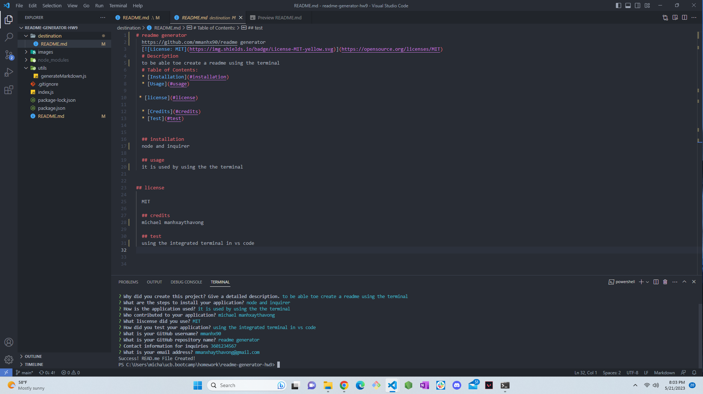

# readme-generator-hw9
  https://github.com/MManhx90/readme-generator-hw9
  
  # Description
  To create a professional READme.md generator for all future homework assignments. It consists of all the contents that would be in a professional READme.md
  # Table of Contents:
  * [Installation](#installation)
  * [Usage](#usage)
  
 * [license](#license)

  * [Credits](#credits)
  * [Test](#test)
  

  ## installation
  Used node and iquirer.

  ## usage
  It is used within the terminal.
  
  
## license

  MIT

  ## credits
  Michael Manhxaythavong

  ## test
  By using the intergrated terminal with in VS Code.

 
 
 
  